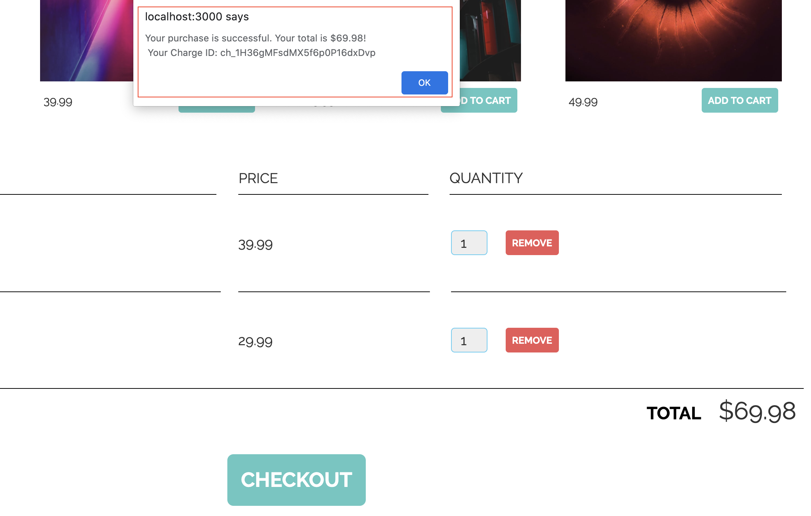

# E-commerce App Using Node.JS and Stripe Checkout

## Application Overview 

Utilizing the [Charges](https://stripe.com/docs/api/charges) and [Tokens](https://stripe.com/docs/api/tokens) APIs, this Express app allows users to accept payments through Stripe [Checkout](https://stripe.com/docs/payments/checkout). Upon a successful payment, the app returns a JSON response displaying the total amount of the charge and Stripe charge Id.

#### Design Flow:

1. User clicks on the ‘Add to Cart’ button to add selected items to a cart at the bottom of the page. Users can modify item quantity, remove item, or add additional items. 


2. User clicks on the ‘Checkout’ button. This prompts the user to enter his/her payment information in the Strip Checkout pop-up. 


</b>

The Checkout pop-up will collect the user’s information and send it to Stripe. Stripe will then parse this information, tokenize it, and send the token to the server we created in this sample application. Using the token and the secret API key, we can then create charges on the server.


3. User will receive a payment confirmation isplaying the total amount of the charge and Stripe charge Id.




4. User clicks OK to reset cart to $0. 


#### Libraries Used :

* [EJS](https://ejs.co/):
* [Express](https://expressjs.com/):
* [Strip](https://stripe.com/docs/development/quickstart):


#### Run App Locally


1. Clone app from Github

```
https://github.com/kebedemeron905/express-stripe.git
```


2. Install dependencies

```
npm install --save express ejs stripe
```

3. Run the application

```
node server.js
```

4. Go to `localhost:3000` to add items to cart, checkout, and receive payment confirmation

## Design Approach


## Language/Frameworks Used


## How to Extend App with Stripe